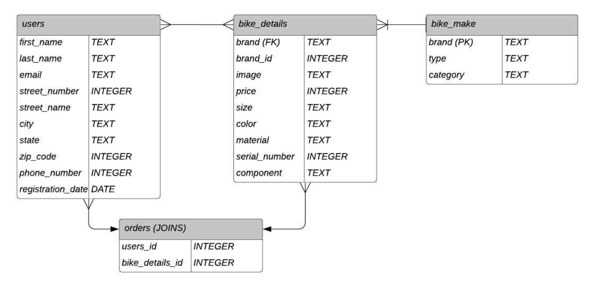

# CycleList (eCommerce Site) 

## Technologies Used
* Node  
* Express  
* React  
* SQLite  
* MongoDB  
* Mongoose  
* Entity Relationship Diagram  

## REST API
Below are React Bike Shop's current endpoints. To access full CRUD operators, you can try it out using Postman! Note: This project is still in progress, all of the endpoints will be utilized in the application.

### USER - GET, POST, PUT, DELETE
|   Requests      | Path        | Description |
| ----------- | ----------- | ----------- |
|  GET | /api/users | Get information of every user |
|  GET | /api/users/:id | Get a single user's inforation  |
|  POST  | /api/users     |  Create a user information  |
|  PUT  | /api/users/:id       |  Update a user's information   |
|  DELETE  | /api/users/:id      |  Delete information on user  |

### BIKE MAKES - GET, POST, PUT, DELETE
|   Requests      |    Path        | Description |
| ----------- | ----------- | ----------- |
|  GET  | /api/bikemake  | Get all bike make information  |
|  GET  | /api/bikemake:id   | Get a single bike make information  |
|  POST | /api/bikemake  |  Create a bike make information     |
|  PUT  | /api/bikemake/:id  |  Update a bike make information   |
|  DELETE  | /api/bikemake/:id   |  Delete a bike make information  |

### BIKE DETAILS (from bike makes)- GET, POST, PUT, DELETE
|    Requests   |    Path     | Description  |
| ----------- | ----------- | ----------- |
| GET    | /api/bikedetails       |  Get list of all bike details information   |
| GET    | /api/bikedetails/:id   |  Get information on single bike detail  |
| POST   | /api/bikedetails/      |  Create bike detail information  |
| PUT    | /api/bikedetails/:id   |  Update bike detail information   |
| DELETE | /api/bikedetails/:id   |  Delete bike detail information  |

### ORDER JOIN TABLE - GET, POST, PUT, DELETE
|    Requests   |    Path     | Description  |
| ----------- | ----------- | ----------- |
| GET    | /api/orders       |  Get list of all order information   |
| GET    | /api/orders/:id   |  Get information on single customer order   |
| POST   | /api/orders/      |  Create order information  |
| PUT    | /api/orders/:id   |  Update order information   |
| DELETE | /api/orders/:id   |  Delete order information  |

## Entity Relationship Diagram 
